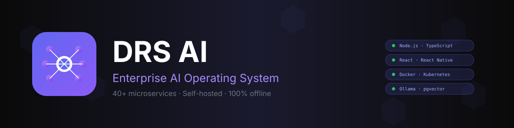
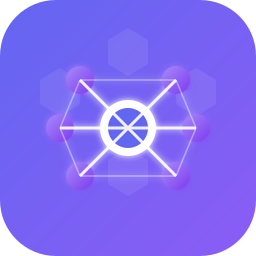

<p align="center">
  
</p>

<h1 align="center">DRS AI</h1>

<p align="center">
  <strong>Enterprise AI Operating System</strong>
  <br/>
  <sub>40+ microservices · Self-hosted · 100% offline · Multi-region</sub>
</p>

<p align="center">
  <a href="https://github.com/CTO-DRS/DRS-AI/releases"></a>
  <a href="LICENSE"></a>
  <a href="https://github.com/CTO-DRS/DRS-AI/actions/workflows/ci.yml"></a>
  <a href="https://github.com/CTO-DRS/DRS-AI/actions/workflows/docker.yml"></a>
  <a href="https://github.com/CTO-DRS/DRS-AI/actions/workflows/codeql.yml"></a>
  
  
  
  
  
  
  
  
</p>

<p align="center">
  <a href="#-quick-start">🚀 Quick Start</a> ·
  <a href="#-architecture">🏗️ Architecture</a> ·
  <a href="docs/">📚 Docs</a> ·
  <a href="CONTRIBUTING.md">🤝 Contributing</a> ·
  <a href="SECURITY.md">🔒 Security</a> ·
  <a href="CHANGELOG.md">🔄 Changelog</a>
</p>

---

## 📖 Overview

DRS AI is a comprehensive, **locally-hosted AI Operating System** that runs entirely offline. Built on a microservices architecture with **40+ integrated services**, it provides a complete enterprise AI solution without requiring internet connectivity or cloud dependencies.

### 🎯 Why DRS AI?

- 🏠 **100% On-Premise** — No cloud dependencies, no data leaves your network
- 🔒 **Privacy-First** — GDPR / CCPA / Saudi NDMO compliant by design
- 🧠 **Multi-Model** — Supports any LLM via Ollama (Llama, Qwen, Mistral, etc.)
- 🌍 **Multilingual** — Arabic (RTL), English, French, German with instant switching
- 🚀 **Production-Ready** — Kubernetes Helm chart, HPA, NetworkPolicy, monitoring
- 🔐 **Secure by Default** — Post-quantum crypto, LLM guardrails, sandboxed code execution
- 📊 **Self-Aware** — Every AI decision explained, audited, and accountable

### 🏗️ Architecture at a Glance

<p align="center">
  
</p>

DRS AI is organized into 5 tiers: **Clients** → **Gateway** → **AI OS Services** → **Global Platform Services** → **Infrastructure**. See [`docs/architecture.md`](docs/architecture.md) for full details.

## 🌟 Features

### Core AI Capabilities
- **Multi-Model Support** - Automatic model selection, voting, and ensemble generation
- **Advanced RAG** - Hierarchical memory with context compression and knowledge graphs
- **Multi-Agent Orchestration** - Coordinated AI agents for complex tasks
- **Code Interpreter** - Safe Python code execution with data analysis
- **Voice Commands** - Speech-to-text and text-to-speech integration

### Integration & Automation
- **Telegram Bot** - Full-featured Telegram integration
- **Workflow Engine** - Visual workflow builder with cron scheduling
- **Plugin System** - Dynamic plugin loading with sandboxed execution
- **Auto Agents** - Event-driven and scheduled autonomous agents
- **Auto App Builder** - Generate full applications from natural language

### Security & Monitoring
- **Cybersecurity Module** - Phishing detection, malware analysis, threat detection
- **JWT + RBAC Authentication** - Role-based access control
- **Prometheus + Grafana** - Full monitoring and observability

### Deployment Options
- **Docker Compose** - One-command deployment
- **Kubernetes Ready** - K8s manifests included
- **Termux Support** - Run on Android without root
- **100% Offline** - No internet required

## 🏗️ Architecture

```
┌─────────────────────────────────────────────────────────────────┐
│                        DRS AI                               │
│                    AI Operating System                          │
└─────────────────────────────────────────────────────────────────┘
                                │
        ┌───────────────────────┼───────────────────────┐
        │                       │                       │
   ┌────▼────┐            ┌────▼────┐            ┌────▼────┐
   │  Core   │            │   AI    │            │  Tools  │
   │Services │            │Services │            │         │
   └────┬────┘            └────┬────┘            └────┬────┘
        │                       │                       │
   ┌────┴───────────────────────┴───────────────────────┴────┐
   │                    Infrastructure                        │
   │  PostgreSQL + pgVector  │  Redis  │  Ollama  │  MinIO   │
   └──────────────────────────────────────────────────────────┘
```

## 📋 Services Overview

| Service | Port | Description |
|---------|------|-------------|
| **Core Services** |||
| Gateway | 3000 | API Gateway & Load Balancer |
| Auth | 3001 | JWT + RBAC Authentication |
| Model Router | 3002 | LLM Routing & Management |
| Agent Orchestrator | 3003 | Multi-Agent Coordination |
| Memory | 3004 | Vector Database & RAG |
| Files | 3005 | File Processing & Storage |
| Voice | 3006 | Voice Commands & TTS |
| Dashboard | 3007 | Admin Dashboard |
| **AI OS Services** |||
| Telegram Bot | 3010 | Telegram Integration |
| Workflow Engine | 3011 | Automation Workflows |
| Plugin System | 3012 | Plugin Management |
| Auto Agent | 3013 | Autonomous Agents |
| Code Interpreter | 3014 | Python Execution |
| Cybersecurity | 3015 | Security Analysis |
| Advanced Memory | 3016 | Enhanced RAG |
| Multi-Model | 3017 | Model Intelligence |
| Auto Builder | 3018 | App Generation |
| **Frontend & Monitoring** |||
| Frontend | 8080 | React Web UI |
| Grafana | 3008 | Monitoring Dashboard |
| Prometheus | 9090 | Metrics Collection |
| **Global Platform Services** |||
| Self-Awareness | 3037 | Digital Health, Uncertainty, Transparency, Decision Explanation |
| GPU Acceleration | 3038 | CUDA Metrics, VRAM Monitor, Offload Manager |
| Distributed Deployment | 3039 | Cluster Manager, Node Registry, Task Router |
| Federated Learning | 3040 | Participant Manager, Model Aggregator, Secure Aggregation |
| Multi-Region Replication | 3041 | Active-Active Replication, Conflict Resolver |
| OAuth2 / OIDC | 3042 | Keycloak, Auth0, Google, GitHub, Azure AD, Okta |
| GPU MIG / Time-Slicing | 3043 | MIG Partitioning + Time-Slicing with Fairness |
| **Clients** |||
| Mobile App | - | React Native + Expo (Android/iOS/Web) |
| Desktop App | - | Electron (macOS/Windows/Linux) |
| **Kubernetes** |||
| Helm Chart | - | `k8s/helm/drs-ai/` with HPA, PDB, NetworkPolicy, Ingress |

## 🚀 Quick Start

### Prerequisites
- Docker & Docker Compose
- 8GB+ RAM (16GB recommended)
- 50GB+ free disk space

### Installation

```bash
# Clone the repository
git clone https://github.com/drs-ai/drs-ai.git
cd drs-ai

# Set environment variables
cp .env.example .env
# Edit .env with your settings

# Start all services
docker-compose up -d

# Pull default models
docker-compose exec ollama ollama pull llama3.2:3b
docker-compose exec ollama ollama pull nomic-embed-text

# Access the UI
open http://localhost:8080
```

### Default Credentials
- **Admin Dashboard**: admin / admin
- **Grafana**: admin / admin

## 📱 Termux Installation (Android)

Run DRS AI on your Android device without root access!

```bash
# Install Termux from F-Droid
# Then run:
curl -fsSL https://raw.githubusercontent.com/drs-ai/termux/main/scripts/install.sh | bash

# Start services
$HOME/start-drs.sh start
```

See [Termux README](./termux/README.md) for detailed instructions.

## 🔧 Configuration

### Environment Variables

```env
# Database
POSTGRES_USER=postgres
POSTGRES_PASSWORD=your-secure-password
POSTGRES_DB=drs_ai

# JWT
JWT_SECRET=your-jwt-secret-key

# Telegram (optional)
TELEGRAM_BOT_TOKEN=your-bot-token

# Ollama
OLLAMA_MODEL=llama3.2:3b
```

### Model Configuration

Edit `multi-model` service to add custom models:

```json
{
  "id": "custom-model",
  "name": "Custom Model",
  "provider": "ollama",
  "modelId": "custom-model:latest",
  "capabilities": ["chat", "completion"]
}
```

## 🛠️ Development

### Project Structure
```
drs-ai/
├── gateway/              # API Gateway
├── auth/                 # Authentication Service
├── model-router/         # LLM Router
├── agent-orchestrator/   # Multi-Agent System
├── memory/               # Vector Database
├── files/                # File Processing
├── voice/                # Voice Commands
├── dashboard/            # Admin Dashboard
├── telegram-bot/         # Telegram Integration
├── workflow-engine/      # Workflow Automation
├── plugin-system/        # Plugin Manager
├── auto-agent/           # Autonomous Agents
├── code-interpreter/     # Code Execution
├── cybersecurity/        # Security Module
├── advanced-memory/      # Enhanced RAG
├── multi-model/          # Model Intelligence
├── auto-builder/         # App Builder
├── frontend/             # React UI
├── termux/               # Android Scripts
├── monitoring/           # Prometheus/Grafana
├── self-awareness/       # Self-Awareness & Transparency (Phase 29)
├── gpu-acceleration/     # GPU Acceleration (Phase 32)
├── distributed-deployment/ # Distributed Deployment (Phase 33)
├── federated-learning/   # Federated Learning (Phase 34)
├── multi-region-replication/ # Multi-Region Replication (Phase 35)
├── oauth-oidc/           # OAuth2 / OIDC Integration (Phase 36)
├── gpu-mig/              # GPU MIG / Time-Slicing (Phase 38)
├── k8s/                  # Kubernetes Helm charts (Phase 37)
├── mobile-app/           # React Native + Expo mobile client
├── desktop-app/          # Electron desktop client
└── docker-compose.yml
```

### Building from Source

```bash
# Build all services
docker-compose build

# Build specific service
docker-compose build gateway

# Development mode
docker-compose -f docker-compose.yml -f docker-compose.dev.yml up
```

## 📊 Monitoring

Access monitoring dashboards:
- **Grafana**: http://localhost:3008
- **Prometheus**: http://localhost:9090

Default metrics collected:
- Request latency & throughput
- Model performance
- Memory usage
- Agent activity
- Workflow execution

## 🔒 Security

### Authentication
- JWT-based authentication
- Role-based access control (RBAC)
- Token refresh mechanism
- Session management

### Cybersecurity Features
- URL/Link phishing detection
- File malware analysis
- Log threat detection
- Password strength analysis

### Best Practices
- All services run in isolated containers
- No external network dependencies
- Secrets managed via environment variables
- Regular security updates

## 🤖 Using the AI OS

### Chat Interface
```bash
# Via CLI
drs chat "What is the weather today?"

# Via API
curl -X POST http://localhost:3000/api/chat \
  -H "Authorization: Bearer $TOKEN" \
  -d '{"message": "Hello AI"}'
```

### Workflow Automation
```bash
# Create workflow
curl -X POST http://localhost:3011/api/workflows \
  -d '{
    "name": "Daily Report",
    "trigger": {"type": "schedule", "cron": "0 9 * * *"},
    "actions": [{"type": "ai_generate", "prompt": "Generate daily report"}]
  }'
```

### Auto App Builder
```bash
# Generate app from description
curl -X POST http://localhost:3018/api/builder/build \
  -d '{
    "description": "Create a task management app with user authentication, CRUD operations, and a modern dark UI"
  }'
```

## 📚 Documentation

- [API Reference](./docs/api-reference.md)
- [Architecture Guide](./docs/architecture.md)
- [Plugin Development](./docs/plugin-development.md)
- [Termux Setup](./termux/README.md)
- [Troubleshooting](./docs/troubleshooting.md)
- [Quick Start Guide](./docs/quick-start.md)
- [Deployment Guide](./docs/deployment.md)
- [Security](./docs/security.md)
- [Code of Conduct](./CODE_OF_CONDUCT.md)
- [Changelog](./CHANGELOG.md)

## 🤝 Contributing

We welcome contributions! Please see [CONTRIBUTING.md](./CONTRIBUTING.md) for guidelines.

### Development Setup

```bash
# Fork and clone
git clone https://github.com/your-username/DRS-AI.git
cd DRS-AI

# Create branch
git checkout -b feature/your-feature

# Make changes and commit (conventional commits)
git commit -m "feat(auth): add refresh token rotation"

# Push and create PR
git push origin feature/your-feature
```

### Good First Issues

Looking for a way to contribute? Check issues labeled [`good first issue`](https://github.com/CTO-DRS/DRS-AI/labels/good%20first%20issue) — they're hand-picked for new contributors.

### Community

- 💬 [GitHub Discussions](https://github.com/CTO-DRS/DRS-AI/discussions) — questions & ideas
- 📱 [Telegram group](https://t.me/drs_ai)
- 📧 Email: support@drs-ai.com

## 📄 License

This project is licensed under the MIT License - see [LICENSE](./LICENSE) file.

## 🙏 Acknowledgments

- [Ollama](https://ollama.ai) — Local LLM inference runtime
- [LangChain](https://langchain.com) — AI orchestration patterns
- [BullMQ](https://bullmq.io) — Job queues
- [ReactFlow](https://reactflow.dev) — Workflow visualization
- [pgvector](https://github.com/pgvector/pgvector) — PostgreSQL vector extension
- [Qdrant](https://qdrant.tech) — Vector database
- [MinIO](https://min.io) — Object storage
- [Prometheus](https://prometheus.io) + [Grafana](https://grafana.com) — Monitoring
- [Expo](https://expo.dev) — React Native tooling
- [Electron](https://electronjs.org) — Cross-platform desktop framework
- All our [contributors](https://github.com/CTO-DRS/DRS-AI/graphs/contributors) 🙌

## 📞 Support

- 🐛 **Bug Reports**: [GitHub Issues](https://github.com/CTO-DRS/DRS-AI/issues/new?template=bug_report.yml)
- 💡 **Feature Requests**: [GitHub Issues](https://github.com/CTO-DRS/DRS-AI/issues/new?template=feature_request.yml)
- 💬 **Questions**: [GitHub Discussions](https://github.com/CTO-DRS/DRS-AI/discussions)
- 🔒 **Security Reports**: [Security Advisories](https://github.com/CTO-DRS/DRS-AI/security/advisories/new)
- 📱 **Telegram Group**: [@drs_ai](https://t.me/drs_ai)
- 📧 **Email**: support@drs-ai.com

## 🗺️ Roadmap

- [x] Core microservices architecture
- [x] Multi-model support
- [x] Advanced RAG with knowledge graphs
- [x] Workflow automation
- [x] Plugin system
- [x] Auto app builder
- [x] Termux support
- [x] **Mobile app (React Native + Expo)** — `mobile-app/` — multilingual (ar/en/fr/de), Chat/Voice/Files/Models/Settings screens, RTL
- [x] **Desktop app (Electron)** — `desktop-app/` — macOS/Windows/Linux with native menus, system tray, auto-updater
- [x] **GPU acceleration** — `gpu-acceleration/` (port 3038) — CUDA metrics, VRAM monitor, offload manager (always_gpu / prefer_gpu / adaptive / cpu_only)
- [x] **Distributed deployment** — `distributed-deployment/` (port 3039) — node registry, task router (round_robin / least_loaded / capacity_first / affinity), cluster manager with failover
- [x] **Federated learning** — `federated-learning/` (port 3040) — participant manager, model aggregator (FedAvg / FedProx / FedSGD), secure aggregation (pairwise masking)
- [x] **Self-awareness & transparency** — `self-awareness/` (port 3037) — digital health, epistemic uncertainty, transparency dashboard, decision explanation engine
- [x] **Multi-region active-active replication** — `multi-region-replication/` (port 3041) — region manager, replication engine (async/sync/quorum), conflict resolver (LWW/vector-clock/merge)
- [x] **OAuth2 / OIDC integration** — `oauth-oidc/` (port 3042) — Keycloak, Auth0, Google, GitHub, Azure AD, Okta with PKCE + encrypted token store
- [x] **Kubernetes Helm charts** — `k8s/helm/drs-ai/` — production-ready chart with HPA, PDB, NetworkPolicy, Ingress
- [x] **GPU sharing via MIG / time-slicing** — `gpu-mig/` (port 3043) — MIG partitioning for Ampere/Hopper + time-slicing with fairness tracking for non-MIG GPUs
- [ ] Multi-cloud federation (AWS / GCP / Azure)
- [ ] GPU multi-tenant quota with billing
- [ ] Edge / IoT gateway service

---

<p align="center">
  
  <br/>
  <strong>DRS AI</strong> — Your Local AI Operating System
  <br/>
  Made with ❤️ by the <a href="https://github.com/CTO-DRS">DRS Team</a>
  <br/>
  <sub>© 2026 DRS AI. MIT Licensed.</sub>
</p>
