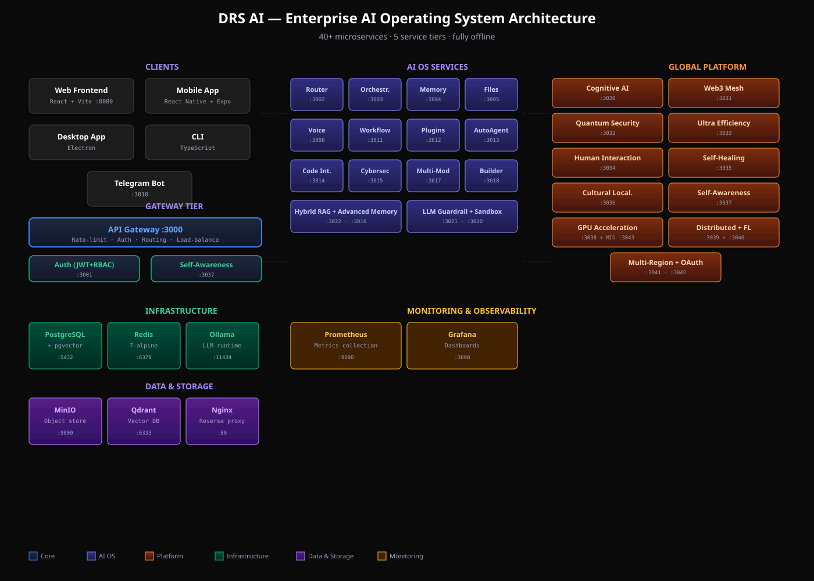

# 📚 DRS AI Documentation

Welcome to the DRS AI documentation. This is the source of truth for understanding, deploying, extending, and troubleshooting the platform.

## 🗺️ Documentation Map

| Doc | Description | Audience |
|-----|-------------|----------|
| **[Architecture](./architecture.md)** | 5-tier service topology, design decisions, data flow | Developers, Architects |
| **[API Reference](./api-reference.md)** | HTTP endpoints for all 40+ services | API consumers, Integrators |
| **[Deployment Guide](./deployment.md)** | Docker Compose, Kubernetes, multi-region, Termux | DevOps, SRE |
| **[Plugin Development](./plugin-development.md)** | How to write & load custom plugins | Plugin developers |
| **[Security](./security.md)** | Threat model, hardening, compliance, audit | Security teams |
| **[Troubleshooting](./troubleshooting.md)** | Common issues and solutions | Everyone |
| **[Quick Start](./quick-start.md)** | Get up and running in 5 minutes | New users |

## 🚀 Quick Links

- 🏠 [Main README](../README.md)
- 📊 [Transformation Progress](../TRANSFORMATION_PROGRESS.md)
- 🔄 [Changelog](../CHANGELOG.md)
- 🤝 [Contributing Guide](../CONTRIBUTING.md)
- 🔒 [Security Policy](../SECURITY.md)
- 🗂️ [Helm Chart](../k8s/README.md)

## 📐 Architecture at a Glance

DRS AI is organized into **5 tiers**:

1. **Clients** — Web, Mobile, Desktop, CLI, Telegram Bot
2. **Gateway** — API Gateway + Auth + Self-Awareness (entry points)
3. **AI OS Services** — Router, Orchestrator, Memory, Files, Voice, Workflow, Plugins, etc.
4. **Global Platform Services** — Cognitive AI, Quantum Security, Federated Learning, Multi-Region, OAuth, GPU MIG, etc.
5. **Infrastructure** — PostgreSQL+pgvector, Redis, Ollama, MinIO, Qdrant, Prometheus, Grafana

See [architecture.md](./architecture.md) for full details.

## 📖 Service Catalog

### Core Services (Ports 3000-3007)
| Service | Port | Purpose |
|---------|------|---------|
| Gateway | 3000 | API entry point, routing, rate-limiting |
| Auth | 3001 | JWT + RBAC authentication |
| Model Router | 3002 | LLM routing & model management |
| Agent Orchestrator | 3003 | Multi-agent coordination |
| Memory | 3004 | Vector database & RAG |
| Files | 3005 | File processing & storage |
| Voice | 3006 | STT + TTS |
| Dashboard | 3007 | Admin dashboard |

### AI OS Services (Ports 3010-3018)
| Service | Port | Purpose |
|---------|------|---------|
| Telegram Bot | 3010 | Telegram integration |
| Workflow Engine | 3011 | Visual workflows + cron |
| Plugin System | 3012 | Sandboxed plugin loading |
| Auto Agent | 3013 | Autonomous scheduled agents |
| Code Interpreter | 3014 | Python execution sandbox |
| Cybersecurity | 3015 | Threat & malware analysis |
| Advanced Memory | 3016 | Enhanced RAG |
| Multi-Model | 3017 | Model intelligence |
| Auto Builder | 3018 | NL → app generation |

### Advanced Infrastructure (Ports 3020-3025)
| Service | Port | Purpose |
|---------|------|---------|
| Security Sandbox | 3020 | Docker code execution |
| LLM Guardrail | 3021 | Prompt injection + content mod |
| Hybrid RAG | 3022 | Vector + full-text search |
| Polyglot Interpreter | 3023 | Multi-language execution |
| Git Automator | 3024 | Git ops automation |
| Edge Optimizer | 3025 | Edge deployment |

### Global Platform Services (Ports 3030-3043)
| Service | Port | Purpose |
|---------|------|---------|
| Cognitive AI | 3030 | Persona + visual reasoning |
| Web3 Mesh | 3031 | IPFS + libp2p + contracts |
| Quantum Security | 3032 | Kyber + Dilithium + honeypot |
| Ultra Efficiency | 3033 | Hibernation + distillation |
| Human Interaction | 3034 | AR + voice + gestures |
| Self-Healing | 3035 | Self-coding + auto-PR |
| Cultural Localization | 3036 | Arabic dialects + RTL |
| Self-Awareness | 3037 | Health + uncertainty + transparency |
| GPU Acceleration | 3038 | CUDA + VRAM + offload |
| Distributed Deployment | 3039 | Cluster + task router |
| Federated Learning | 3040 | FedAvg + secure aggregation |
| Multi-Region Replication | 3041 | Active-active replication |
| OAuth2 / OIDC | 3042 | Keycloak/Auth0/Google/GitHub/Azure/Okta |
| GPU MIG / Time-Slicing | 3043 | MIG partitioning + fairness |

## 🎯 Choosing a Deployment Method

| If you want to... | Use |
|-------------------|-----|
| Try DRS AI locally | `docker-compose up -d` |
| Deploy to a Kubernetes cluster | `helm install drs-ai k8s/helm/drs-ai` |
| Run on Android | Termux install script |
| Multi-region HA | Multiple Helm releases + multi-region-replication service |
| Just the chat UI | Start `gateway`, `auth`, `router`, `orchestrator`, `memory` + `frontend` |

## 🆘 Getting Help

- 💬 [GitHub Discussions](https://github.com/CTO-DRS/DRS-AI/discussions) — questions & ideas
- 🐛 [GitHub Issues](https://github.com/CTO-DRS/DRS-AI/issues) — bugs & features
- 📧 Email: CTO-DRS@users.noreply.github.com
- 📱 Telegram: [GitHub Discussions](https://github.com/CTO-DRS/DRS-AI/discussions)
- 📖 [Troubleshooting guide](./troubleshooting.md)
